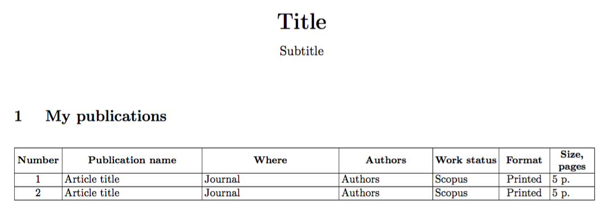

# Table Converter

Why? It is quite often when you need to send somewhere or show someone, for example, your list of
publications. And each time it may be required in different format: pdf, html, docx etc. It is
highly unlikely that somebody would keep such tables in all formats because manual converting is
tedious and difficult: imagine that you have to add many records to such a table - it will take a
lot of time to add it to all files. Also if you need to sort your table or reorder columns, you will
have to spend a lot of time reordering and sorting it by hand (especially, if it is in latex or txt). 

Main features:

- Tables are stored in YAML, so it is easy to read, edit and store them under repository.
- Tables are easily exported to pdf, docx or txt formats.
- Tables can be automatically sorted by specified columns when exporting.
- It is possible to create custom templates.

# Requirements and installation

## Python requirements

- Python 3.5+
- PyYAML
- python-docx
- jinja2

## LaTeX requirements

- pdflatex

LaTeX packages:
    
- inputenc
- babel
- longtable
- array
- geometry

## Installation

Run:

```sh
$ git clone https://github.com/antonlukyanov/taco.git
$ cd taco
$ ./setup install
```

or:

```sh
$ pip3 install taco.py
```

# Usage

In order to use `taco.py` you need to have at least four file:

1. `layout.yml`
    
    Contains title, subtitle and description which wiill be  displayed at the top of
    a page.

2. `layout_settings.yml`
    
    Contains paper settings (size, orientation, margins)

3. `table.yml`

    Contains table data.

4. `table_settings.yml`

    Specifies how and which columns to display.


First of all create file with table data:

```sh
$ touch publications.yml
```

Each data file corresponds to one table.

```yaml
# publications.yml

publications:
  # Title and description are displayed before the table.
  title: My publications
  description: Some description.

  # List all columns of the table.
  fields:
    - title
    - authors
    - coauthorship
    - date
    - where
    - format
    - size
    - status
    - url

  # You can optionally sort table, using the following syntax:
  # <field1> <order>, <field2> <order>, ...
  # <order> is either desc or asc.
  sort: date desc, title asc

  rows:
    # You can either specify a list of dictionaries or a list of lists, where each
    # item corresponds to field listed in 'fields' above.
    - title: Article title
      authors: Authors
      coauthorship: Indivisible
      date: 2016
      where: Journal
      format: Printed
      size: 5 p.
      status: Scopus
      url: http://example.com

    - - Article title
      - Authors
      - Indivisible
      - 2016
      - Journal
      - Printed
      - 5 p.
      - Scopus
      - http://example.com
```

Every data file must have a corresponding settings file in the same folder. For example settings file
for `publications.yml` will be `publications_settings.yml`. Settings files define which template to
use for rendering (either table or list), table columns and their settings:

```yaml
# publications_settings.yml

tex: &tex
  # It may be either 'table' or 'list'.
  template: table
  columns:
    # 'INDEX' is the special field which corresponds to row number.
    - field: INDEX
      name: Number
      # Width may be specified either in cm or mm.
      width: 1.2cm
      alignment: c

    - field: title
      name: Publication name
      width: 4.4cm
      alignment: p

    - field: where
      name: Where
      width: 4.3cm
      alignment: p

    - field: authors_tex
      name: Authors
      width: 2.9cm
      alignment: p

    - field: status
      name: Work status
      width: 2cm
      alignment: l

    - field: format
      name: Format
      width: 1.5cm
      alignment: c

    - field: size
      name: Size, pages
      width: 1.3cm
      alignment: p

  # In case of 'list' template, specify here a sequence of fields, whose values
  # will be concatenated and represented as list items.
  items:
    - title
    - authors
    - where

# PDF is made by first creating tex-template and then by converting this template
# using pdflatex, so it may be quite enough to just link to 'tex' settings.
pdf: *tex

docx:
  template: table
  columns:
    - field: INDEX
      name: Number
      width: 2cm

    - field: title
      name: Publication name
      width: 9cm

    - field: format
      name: Format
      width: 2cm

    - field: where
      name: Where
      width: 5cm

    - field: size
      name: Size, pages
      width: 2cm

    - field: authors
      name: Authors
      width: 3cm

    - field: status
      name: Status
      width: 3cm
```

Possible values for `alignment`:


Value | Alignment
----- | ----------
l     | left
r     | right
c     | center
p     | vertically aligned text at the top
b     | vertically aligned text at the bottom
m     | vertically aligned text in the middle

Create `layout.yml`:

```sh
$ touch layout.yml
```

This file contains title, subtitle and description of the page which will contain specified tables.

```yaml
# layout.yml

layout:
  title: Title
  subtitle: Subtitle
  description: Description.
```

Lastly, create `layout_settings.yml`:

```sh
$ touch layout_settings.yml
```

Layout settings specify paper size and margins.

```yaml
# layout_settings.yml

tex: &tex
  paper_setup:
    size: A4
    orientation: landscape
    margins:
      left: 10mm
      right: 10mm
      top: 10mm
      bottom: 20mm

pdf: *tex

docx:
  paper_setup:
    size: A4
    orientation: landscape
    margins:
      left: 20mm
      right: 10mm
      top: 10mm
      bottom: 10mm
```

Finally, build your file:

```sh
$ taco.py layout.yml publications.yml publications.pdf
```

You don't need to explicitely specify settings files, their names are inferred from input
file names and they are automatically loaded. `publications.pdf` now looks like this:



You can also compile several tables at once:

```
$ taco.py layout.yml table1.yml table2.yml ... output.docx
```